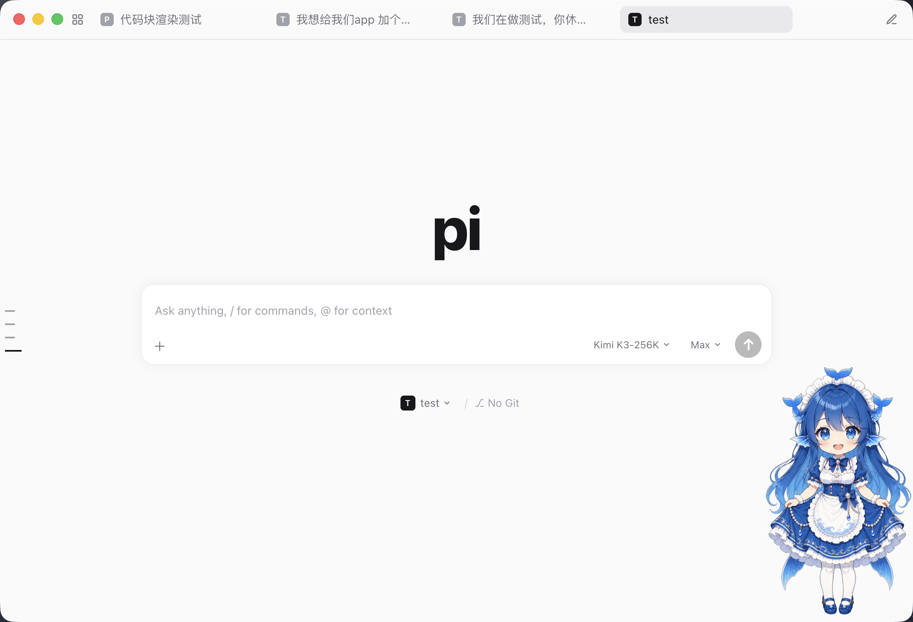
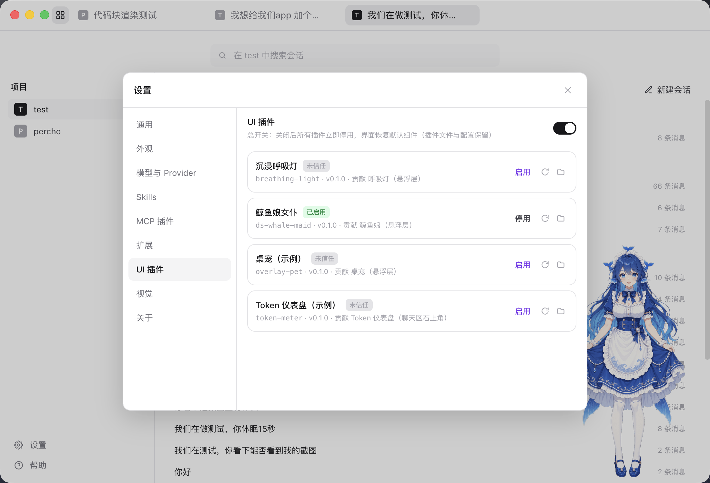
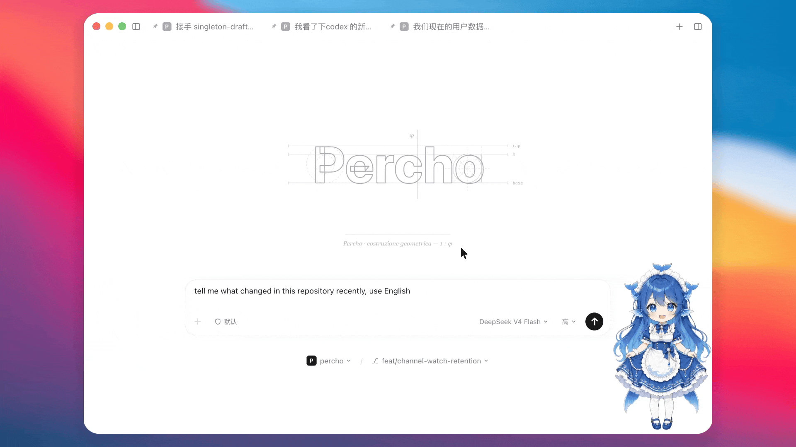
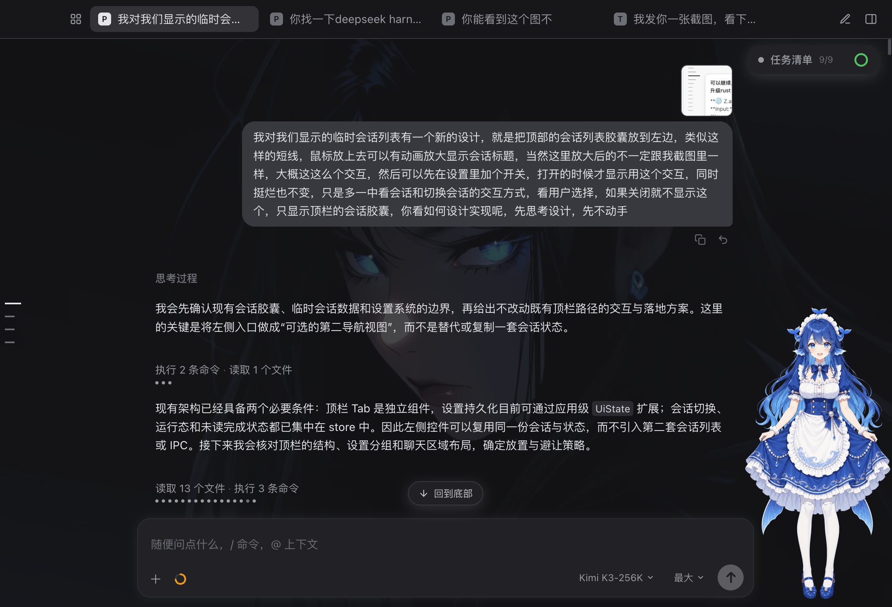
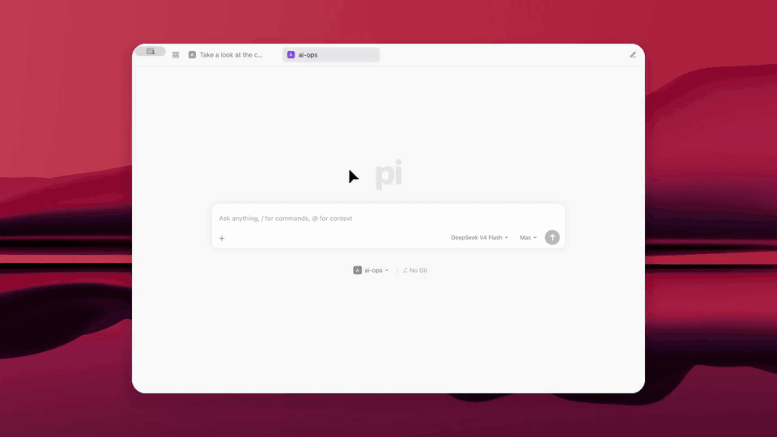
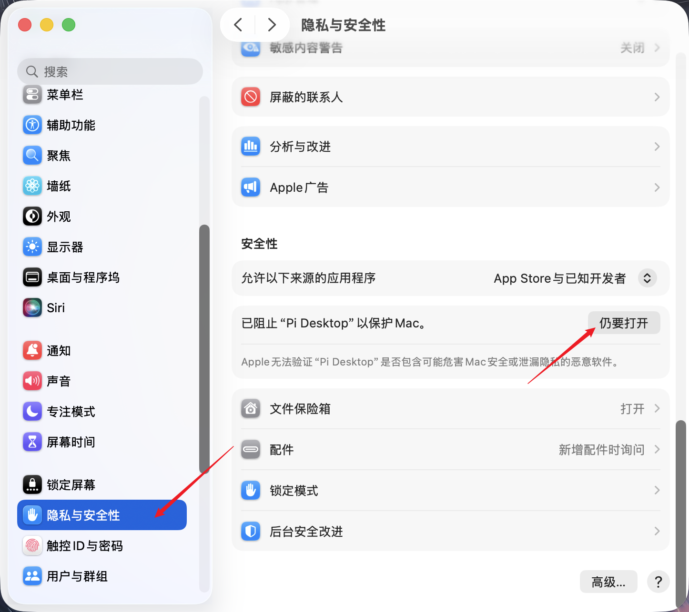

<p align="center">
  
</p>
<h1 align="center">percho</h1>
<p align="center">
  Highly customizable desktop GUI for the <a href="https://www.npmjs.com/package/@earendil-works/pi-coding-agent">Pi coding agent</a> — the same engine as the Pi CLI, in a clean visual interface. Multi-session chat, visual tool approvals, UI plugins, and custom themes.
</p>
<p align="center">
  <a href="LICENSE"></a>
  <a href="https://github.com/Jaxton07/percho/releases"></a>
  <a href="https://github.com/Jaxton07/percho/releases"></a>
  <a href="https://github.com/Jaxton07/percho/actions/workflows/ci.yml"></a>
  <a href="https://github.com/Jaxton07/percho"></a>
  =22.19">
  
</p>
<p align="center">
  <a href="README.md">English</a> | <a href="README.zh.md">简体中文</a>
</p>

---

## Demo





**Chat**



**Custom background & dark theme**



**Settings — providers & models**



## Why percho?

percho embeds the official Pi SDK (`@earendil-works/pi-coding-agent`) in the Electron main process. It is **not a fork and not a reimplementation** — it runs the same engine as the Pi CLI and inherits Pi's native strengths:

- **Extensibility** — TypeScript extensions, skills, and prompt templates installed for the Pi CLI work here too, including project-local ones (with a trust prompt before loading). Adapt Pi to your workflows, no forking required.
- **Shared configuration** — same `~/.pi/agent/` directory as the CLI: sessions, auth, and model settings carry over. Start a session in the terminal, continue it in the GUI.
- **Providers** — subscriptions (Claude Pro/Max, ChatGPT Plus/Pro Codex, GitHub Copilot) and API keys for Anthropic, OpenAI, Gemini, DeepSeek, Bedrock, and more.

And for those who prefer a GUI over a TUI:

- Highly customizable UI — swap tool-call cards, drop in desk-pet overlays, or extend the settings panel via UI plugins (a whale-maid desk pet ships built in)
- Visual permission gates — approve or deny each tool call from a dock, backed by a per-tool rule engine
- Multi-session sidebar, per-session composer drafts, follow-up queue with undo
- Streaming markdown rendering, image previews, message copy
- Agent-initiated image display — a built-in `show_image` tool lets the agent deliberately show you images inline (single or grouped), without turning every tool result into noise
- Custom background image with adjustable overlay dimming, light/dark/system themes

## Download

Prebuilt installers are published on the [Releases](https://github.com/Jaxton07/percho/releases) page.

| Platform | Download |
| --- | --- |
| macOS (Apple Silicon) | `percho-mac-arm64.dmg` |
| macOS (Intel) | `percho-mac-x64.dmg` |
| Windows | `percho-windows-x64.exe` |

> Builds are ad-hoc signed (no Developer ID certificate). On macOS, the first launch after a download may show **"Apple cannot verify Percho is free from malware"** — that's Gatekeeper blocking an un-notarized app. To open it:
>
> 1. **System Settings → Privacy & Security** → scroll to the bottom → click **Open Anyway** next to the Percho entry, then confirm with your password or Touch ID (recommended).
>
>    
>
> 2. Or in Terminal: `xattr -cr "/Applications/Percho.app"`.
>
> Only the first launch of each downloaded version needs this — later updates install automatically in-app and skip Gatekeeper entirely. On Windows, click "More info" → "Run anyway" when SmartScreen appears.

## Configuration

API keys are never stored in this repo or written into the app bundle. `~/.pi/agent/models.json` references environment variables (e.g. `$AI_OPS_API_KEY`) and keys stay in your shell environment. If you already use the Pi CLI, your existing setup just works.

## Development

Prerequisites: **Node.js >= 22.19**.

```bash
npm install
npm run dev
```

npm workspaces monorepo, three packages: `packages/shared` (IPC contracts), `packages/backend` (the only place that imports the Pi SDK), `packages/desktop` (Electron + React 19 + Tailwind 4 + Zustand). Common commands: `npm run typecheck` / `test` / `lint` / `build` / `dist`.

See [CONTRIBUTING.md](CONTRIBUTING.md) for the full guide. If you are in China and the Electron binary download stalls, set `ELECTRON_MIRROR=https://npmmirror.com/mirrors/electron/` first.

## Disclaimer

percho is a community project. It is **not** built by or affiliated with the Pi team (earendil-works).

## License

[MIT](LICENSE)
