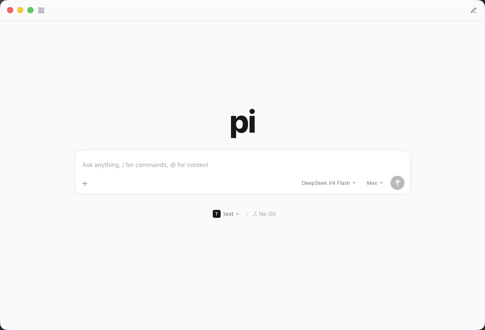
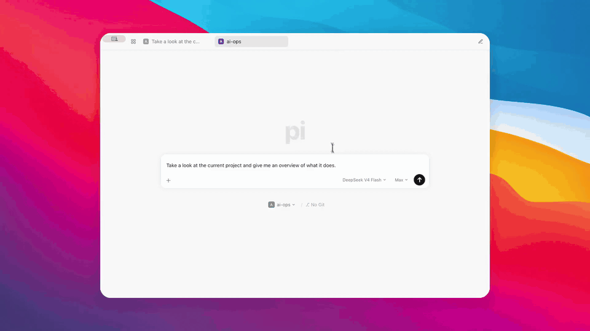

<p align="center">
  
</p>
<h1 align="center">pi-desktop</h1>
<p align="center">
  <a href="https://www.npmjs.com/package/@earendil-works/pi-coding-agent">Pi coding agent</a> 的桌面端 GUI —— 保留 Pi 的全部能力与可扩展性，加上可视化的交互界面。
</p>
<p align="center">
  <a href="LICENSE"></a>
  <a href="https://github.com/Jaxton07/pi-desktop/releases"></a>
  <a href="https://github.com/Jaxton07/pi-desktop/releases"></a>
  <a href="https://github.com/Jaxton07/pi-desktop/actions/workflows/ci.yml"></a>
  <a href="https://github.com/Jaxton07/pi-desktop"></a>
  =22.19">
  
</p>
<p align="center">
  <a href="README.md">English</a> | <a href="README.zh.md">简体中文</a>
</p>

---

## 演示



**聊天页**



**设置页 —— 模型与 Provider**


## 为什么选择 pi-desktop？

pi-desktop 把官方 Pi SDK（`@earendil-works/pi-coding-agent`）跑在 Electron 主进程里。**不是 fork，也不是重新实现** —— 它和 Pi CLI 用的是同一套引擎，完整继承 Pi 的原生优势：

- **可扩展性** —— 为 Pi CLI 安装的 TypeScript 扩展、Skills、Prompt 模板在这里同样生效，包括项目级资源（加载前会有信任确认）。让 Pi 适应你的工作流，无需 fork。
- **配置共享** —— 与 CLI 共用 `~/.pi/agent/` 目录：会话、认证、模型配置全部互通。终端里开的会话，可以在 GUI 里继续。
- **模型来源** —— 支持订阅（Claude Pro/Max、ChatGPT Plus/Pro Codex、GitHub Copilot）以及 Anthropic、OpenAI、Gemini、DeepSeek、Bedrock 等 API key。

同时，为更喜欢图形界面的用户提供：

- 极简设计美学 —— 界面保持 Pi 一贯的清爽干净，不堆砌元素
- 可视化权限审批 —— 在底部审批坞里逐个批准/拒绝工具调用，背后是逐工具的规则引擎
- 多会话侧栏、逐会话输入草稿、可撤销的跟进消息队列
- 流式 Markdown 渲染、图片预览、消息复制

## 下载

预编译安装包发布在 [Releases](https://github.com/Jaxton07/pi-desktop/releases) 页面。

| 平台 | 下载 |
| --- | --- |
| macOS (Apple Silicon) | `pi-desktop-mac-arm64.dmg` |
| macOS (Intel) | `pi-desktop-mac-x64.dmg` |
| Windows | `pi-desktop-windows-x64.exe` |

> 目前构建未签名。macOS 首次打开可能提示**「Pi Desktop 已损坏，无法打开」**—— 这是 Gatekeeper 拦截未签名的下载文件，并非真的损坏。执行 `xattr -cr "/Applications/Pi Desktop.app"` 移除隔离属性后即可正常打开（右键「打开」对此无效）。Windows 上 SmartScreen 提示时点「更多信息」→「仍要运行」。

## 配置

API key 不会存入本仓库，也不会打进安装包。`~/.pi/agent/models.json` 通过环境变量引用（如 `$AI_OPS_API_KEY`），key 只存在于你的 shell 环境中。如果你已经在用 Pi CLI，现有配置开箱即用。

## 开发

前置要求：**Node.js >= 22.19**。

```bash
npm install
npm run dev
```

npm workspaces monorepo，三个包：`packages/shared`（IPC 契约）、`packages/backend`（唯一 import Pi SDK 的地方）、`packages/desktop`（Electron + React 19 + Tailwind 4 + Zustand）。常用命令：`npm run typecheck` / `test` / `lint` / `build` / `dist`。

完整指南见 [CONTRIBUTING.md](CONTRIBUTING.md)。国内下载 Electron 二进制太慢的话，先设置 `ELECTRON_MIRROR=https://npmmirror.com/mirrors/electron/`。

## 声明

pi-desktop 是社区项目，**并非** Pi 团队（earendil-works）官方出品，也与其无任何隶属关系。

## License

[MIT](LICENSE)
