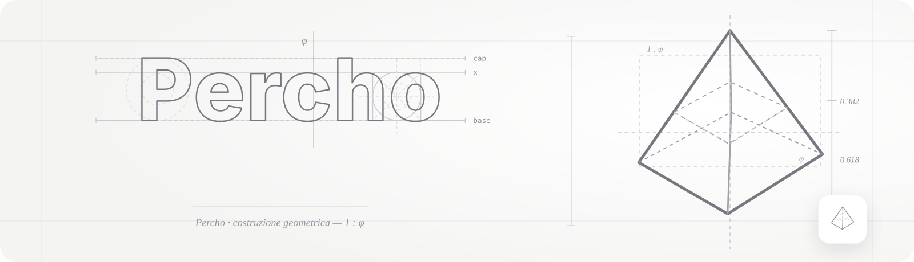
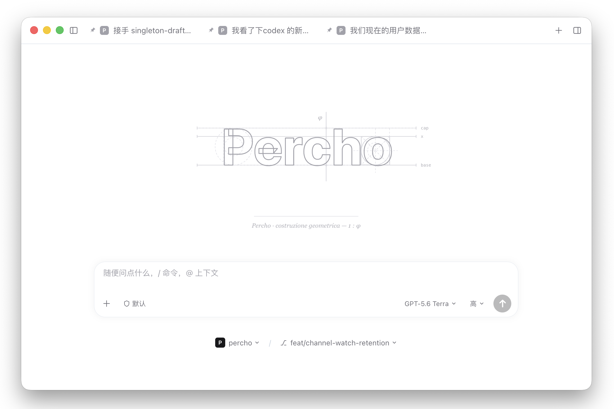
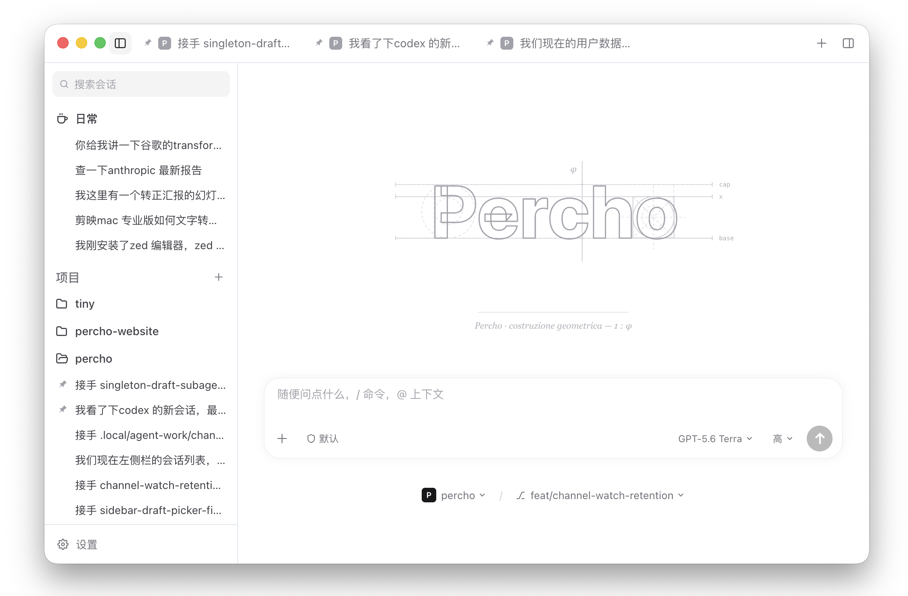
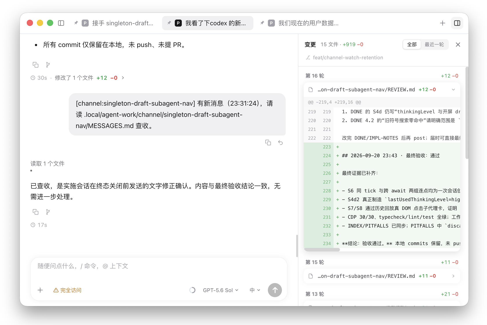

<p align="center">
  <picture>
    <source media="(prefers-color-scheme: dark)" srcset="docs/assets/img/readme-hero-dark.svg">
    
  </picture>
</p>
<h1 align="center">Percho</h1>
<p align="center">
  高度自定义的 <a href="https://www.npmjs.com/package/@earendil-works/pi-coding-agent">Pi coding agent</a> 桌面端 GUI —— 与 Pi CLI 同源同引擎，干净清爽的视觉界面。多会话聊天、可视化工具审批、内置子代理、UI 插件、自定义主题。
</p>
<p align="center">
  <a href="LICENSE"></a>
  <a href="https://github.com/Jaxton07/percho/releases"></a>
  <a href="https://github.com/Jaxton07/percho/releases"></a>
  <a href="https://github.com/Jaxton07/percho/actions/workflows/ci.yml"></a>
  <a href="https://github.com/Jaxton07/percho"></a>
  =22.19">
  
</p>
<p align="center">
  <a href="README.md">English</a> | <a href="README.zh.md">简体中文</a>
</p>

---

## 演示








**聊天页**


**自定义背景 + 深色主题**


## 为什么选择 Percho？

Percho 把官方 Pi SDK（`@earendil-works/pi-coding-agent`）跑在 Electron 主进程里。**不是 fork，也不是重新实现** —— 它和 Pi CLI 用的是同一套引擎，完整继承 Pi 的原生优势：

- **可扩展性** —— 为 Pi CLI 安装的 TypeScript 扩展、Skills、Prompt 模板在这里同样生效，包括项目级资源（加载前会有信任确认）。让 Pi 适应你的工作流，无需 fork。
- **配置共享** —— 与 CLI 共用 `~/.pi/agent/` 目录：会话、认证、模型配置全部互通。终端里开的会话，可以在 GUI 里继续。
- **模型来源** —— 支持订阅（Claude Pro/Max、ChatGPT Plus/Pro Codex、GitHub Copilot，应用内 OAuth 登录）以及 Anthropic、OpenAI、Gemini、DeepSeek、Bedrock 等 API key；还支持自定义 provider 与 base URL 覆写（中转站场景）。

同时，为更喜欢图形界面的用户提供：

- 高度自定义界面 —— UI 插件可替换工具调用卡、添加桌宠浮层（内置鲸鱼娘 + Q 版两只）、扩展设置面板
- 可视化权限审批 —— 在底部审批坞里逐个批准/拒绝工具调用，背后是逐工具的规则引擎
- 可折叠的项目/会话侧栏、可拖拽排序的顶部置顶会话、逐会话输入草稿、可撤销的跟进消息队列
- 内置子代理 —— 自带 scout 与自定义 agent 定义、并行任务拆分，点开运行卡片即可只读检视子会话
- 上下文蒸发（默认开启）—— 到龄的工具输出自动蒸发为紧凑 stub，长会话不超预算
- 统一报错系统 —— 对话内错误卡一键重试、自动重试状态行、渲染进程全屏崩溃恢复
- 扎实的会话工作台 —— 从助手回复或选中的上下文分叉、撤回自己的消息回输入框、todo 面板、逐轮 diff 侧栏、斜杠命令面板、@ 文件补全
- 流式 Markdown 渲染、图片预览、消息复制
- Agent 主动发图 —— 内置 `show_image` 工具让 agent 在需要时把图片（单张或成组）直接显示到对话区，而不是把所有工具结果都变成噪音
- 自定义背景图与遮罩透明度，浅色/深色/跟随系统主题
- 局域网伴侣 —— 手机/平板浏览器扫码查看会话；可选开启远程发送、停止生成，以及允许一次/拒绝权限请求

## 下载

预编译安装包发布在 [Releases](https://github.com/Jaxton07/percho/releases) 页面。

| 平台 | 下载 |
| --- | --- |
| macOS (Apple Silicon) | `percho-mac-arm64.dmg` |
| macOS (Intel) | `percho-mac-x64.dmg` |
| Windows | `percho-windows-x64.exe`（安装器）或 `percho-windows-x64.zip` |
| Linux (x64) | `percho-linux-x86_64.AppImage` |

> 构建为 adhoc 临时签名（无 Developer ID 证书）。macOS 下载后首次打开可能提示**「Apple 无法验证 Percho 是否包含危害 Mac 安全或泄漏隐私的恶意软件」**—— 这是 Gatekeeper 拦截未公证的 App。按以下方式放行：
>
> 1. **系统设置 → 隐私与安全性** → 滚动到底部 → 在 Percho 条目旁点**「仍要打开」**，然后输入密码或 Touch ID 确认（推荐）。
>
>    
>
> 2. 或在终端执行：`xattr -cr "/Applications/Percho.app"`。
>
> 更新在应用内检查。Windows 上也在应用内下载安装（点下载，再点重启）；macOS 上 adhoc 签名的构建无法自动安装，点击会跳到 Releases 页 —— 新下载的版本首次打开还会再被 Gatekeeper 拦一次。Windows 上 SmartScreen 提示时点「更多信息」→「仍要运行」。
>
> Linux：首次运行前给 AppImage 加执行位（`chmod +x percho-linux-x86_64.AppImage`）；Ubuntu 22.04+/24.04+ 及衍生发行版需先安装 `libfuse2`（AppImage 依赖 FUSE 2 挂载，新版系统默认未装）。Linux 版在应用内下载并安装更新。

## 开发

前置要求：**Node.js >= 22.19**。

```bash
npm install
npm run dev
```

npm workspaces monorepo，三个包：`packages/shared`（IPC 契约）、`packages/backend`（唯一 import Pi SDK 的地方）、`packages/desktop`（Electron + React 19 + Tailwind 4 + Zustand）。常用命令：`npm run typecheck` / `test` / `lint` / `build` / `dist`。

完整指南见 [CONTRIBUTING.md](CONTRIBUTING.md)。国内下载 Electron 二进制太慢的话，先设置 `ELECTRON_MIRROR=https://npmmirror.com/mirrors/electron/`。

## 声明

Percho 是社区项目，**并非** Pi 团队（earendil-works）官方出品，也与其无任何隶属关系。

## License

[MIT](LICENSE)
